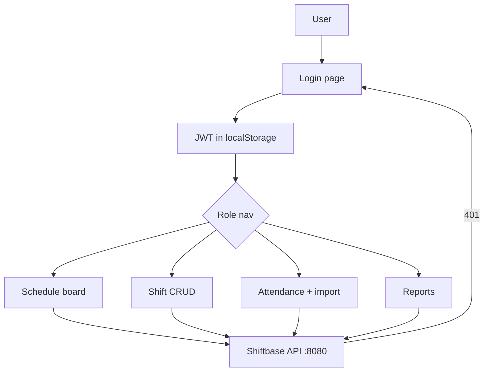

# shiftbase-web

Papan roster untuk shiftbase API — Vite + React + TS + Tailwind v4 + shadcn.
Desain: terang, bidang datar, lajur waktu sebagai elemen khas (tanpa gradien,
tanpa kartu-shadow, tanpa emoji).

## Purpose, Output & Expectations

**Purpose.** Managers need a visual roster board and staff need to see only
their own schedule — without touching the API directly. This web app is the
human face of Shiftbase.

**Output.** Four role-aware pages: a timeline schedule board, shift CRUD with
friendly conflict messages, attendance punch + history + CSV import, and
overtime/coverage reports. JWT in localStorage with 401 auto-logout.

**Expectations.** After pointing it at the API: managers plan the week on the
board in minutes, staff check in/out from the same app, and double-booking
attempts show a clear message instead of a raw error.

## Features

| Feature | Description |
|---|---|
| Schedule board | - Timeline lanes per employee (06:00–24:00) with shift blocks. - Purpose: see the whole day at a glance. Output: who works when, per date. |
| Shift management | - Create/update/delete shifts via dialog; overlap shows a friendly message. - Purpose: plan without API knowledge. Output: conflict-free roster. |
| Attendance | - Punch check-in/out, filterable history, CSV import with per-row results. - Purpose: daily presence + bulk onboarding from the browser. Output: records and import counts. |
| Reports | - Overtime bars per employee and coverage table per date. - Purpose: payroll-ready visuals. Output: overtime hours and headcounts. |

## How It Works



## Dev 5 menit

```bash
npm install
cp .env.example .env            # VITE_API_URL=http://localhost:8080
npm run dev                     # :5173
```

Butuh repo 1 (`RakhaYandra/shiftbase`): API + MySQL + seed jalan, dengan
`FRONTEND_URL=http://localhost:5173`.
Login seed: `admin@shiftbase.local / Admin123!`,
`manager@shiftbase.local / Manager123!`, `staff@shiftbase.local / Staff123!`.

## Halaman & peran

| Halaman | admin | manager | staff |
|---|---|---|---|
| Jadwal (lajur waktu) | ✅ | ✅ | ✅ miliknya |
| Shift (CRUD, bentrok→pesan jelas) | ✅ | ✅ | ❌ |
| Absensi (catat + riwayat + impor CSV) | ✅ | ✅ | ✅ miliknya |
| Laporan (lembur + cakupan) | ✅ | ✅ | ❌ |

Token JWT di `localStorage` (`shiftbase_token`); 401 → keluar otomatis.

## Cek & CI

```bash
npx tsc -b && npm run lint && npm run build
```

CI: Node 22 → `npm ci` → tsc → oxlint → build.
